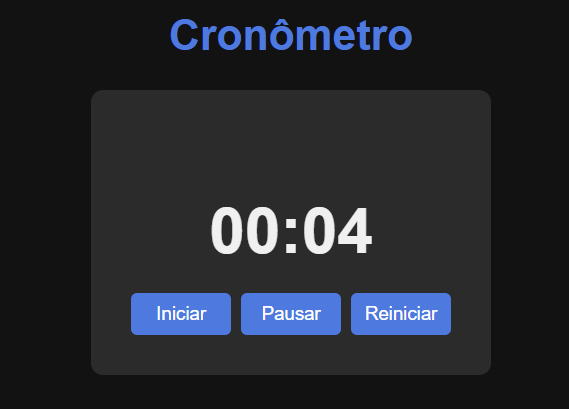

# ⏱️ Cronômetro

Projeto simples de um cronômetro feito com **HTML**, **CSS** e **JavaScript**, com funcionalidades de iniciar, pausar e reiniciar a contagem do tempo. A interface foi feita com foco em um visual escuro, moderno e limpo.



## 🚀 Funcionalidades

- Iniciar a contagem de tempo
- Pausar o cronômetro
- Reiniciar a contagem
- Layout responsivo e estilizado em modo escuro

## 🛠️ Tecnologias utilizadas

- HTML5
- CSS3
- JavaScript (puro)

## 💡 Como utilizar

1. Clone este repositório:
   ```bash
   git clone https://github.com/araujosantos20/cronometro.git
   ```
2. Acesse a pasta do projeto:

   ```bash
   cd cronometro
   ```

3. Abra o arquivo `index.html` no navegador.

## 📁 Estrutura de arquivos

    📦 cronometro
    ├── index.html
    ├── cronometro.css
    └── cronometro.js
    └── img/
        └── cronometro.png

## 📚 Créditos

Este projeto foi desenvolvido como prática pessoal com apoio do [ChatGPT](https://openai.com/chatgpt) para estruturação do HTML e do CSS.

## 👨‍💻 Autor

Feito com 💙 por [Mateus Santos](linkedin.com/in/mateus-sanjo)

- GitHub: [araujosantos20](https://github.com/araujosantos20)

- LinkedIn: [linkedin.com/in/mateus-sanjo](linkedin.com/in/mateus-sanjo)

- Email: [mateus.sanjo20@gmail.com](mailto:mateus.sanjo20@gmail.com?subject=Contato%20via%20Portif%C3%B3lio)
